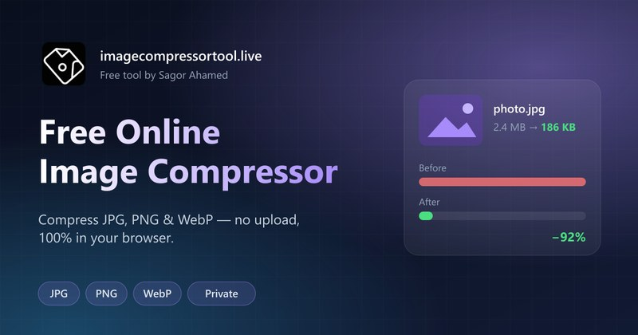
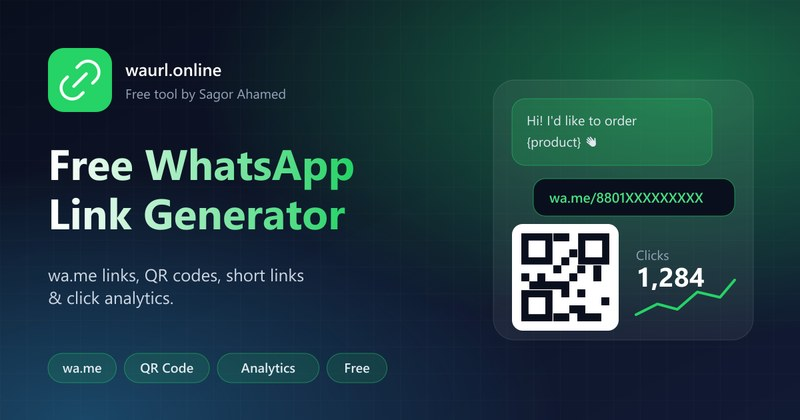
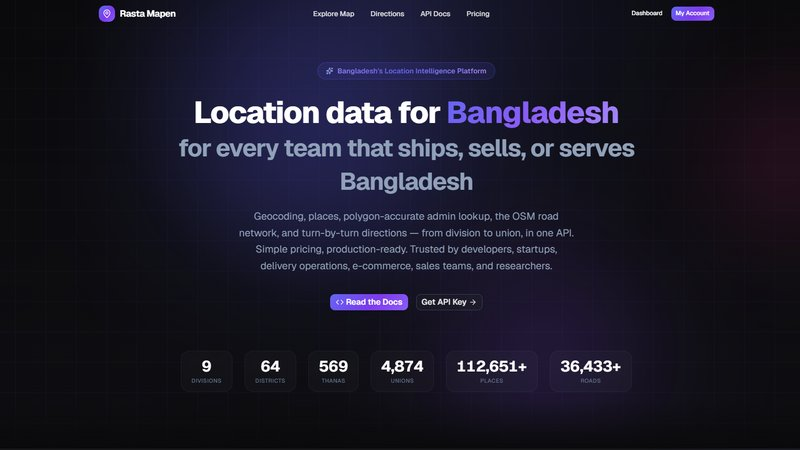
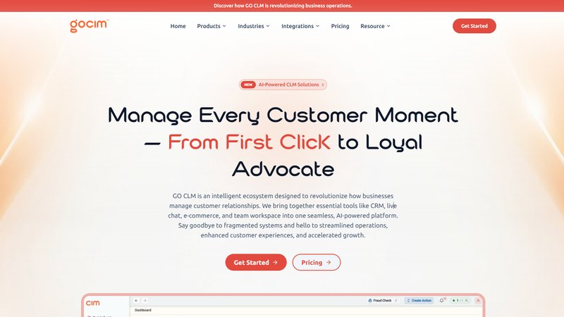
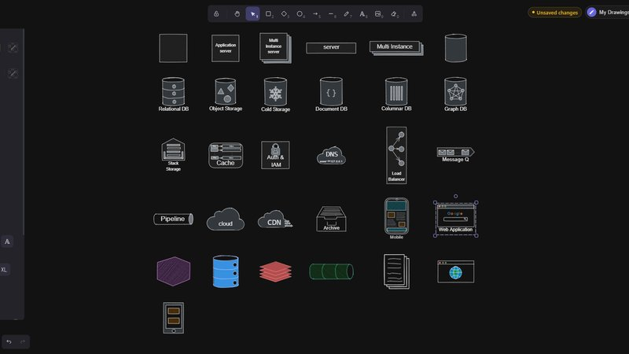
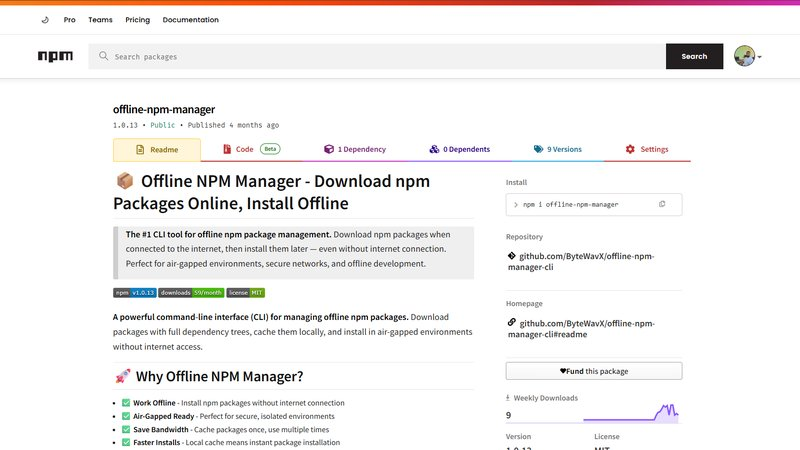
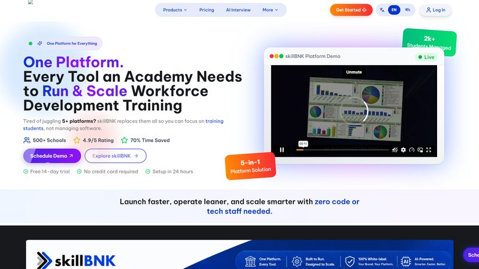
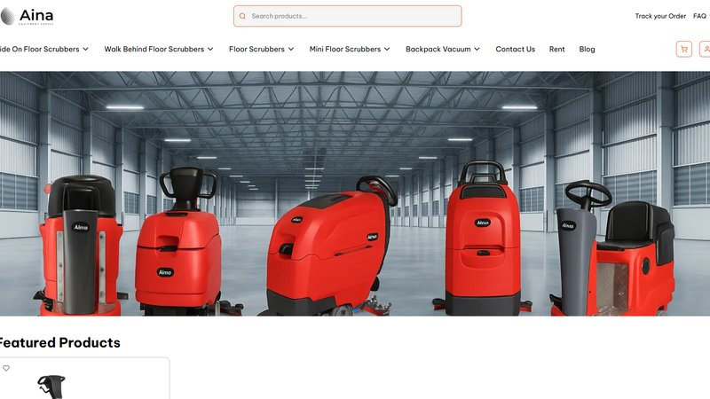

<!-- ===================== HEADER ===================== -->

  

  

  
  
  

  
  
  
  
  
  

  🛠️ <b>My free tools:</b>
  <a href="https://imagecompressortool.live/"><b>Free Online Image Compressor</b></a> ·
  <a href="https://waurl.online/"><b>WhatsApp Link Generator</b></a>

 

<!-- ===================== ABOUT ===================== -->

  

<h3 align="center">Hi, I'm Sagor, a Full Stack Developer from Bangladesh 🇧🇩</h3>

  Building AI-powered products as a Frontend Developer at <a href="https://goclm.io/"><b>WaTheta Ltd</b></a>.

  
  
  
  
  

 

<!-- ===================== TECH STACK ===================== -->
## 🛠️ Tech Stack

  <b>Languages</b>  
  

  <b>Frontend</b>  
  

  <b>Backend &amp; Database</b>  
  

  <b>Tools &amp; Deployment</b>  
  

  
  
  
  
  
  
  
  

  <b>🤖 AI-Powered Development</b>  
  
  
  
  

 

<!-- ===================== EXPERIENCE ===================== -->
## 💼 Experience

<table>
  <tr>
    <td width="50%" valign="top">
      <h3>🚀 Frontend Developer</h3>
      <b><a href="https://goclm.io/">WaTheta Ltd</a></b> 
      📅 Nov 2025 – Present
      <ul>
        <li>Building responsive interfaces for <b>GO CLM</b>, an AI-powered CRM &amp; business automation platform</li>
        <li>Dashboards, authentication systems &amp; workflow builders</li>
      </ul>
      
    </td>
    <td width="50%" valign="top">
      <h3>💻 Frontend Developer</h3>
      <b>TS4U Inc Ltd (now SDB IT)</b> 
      📅 Apr 2024 – Sep 2025
      <ul>
        <li>Built the <b>SkillBnk</b> platform with multiple role-based portals</li>
        <li>Shipped eCommerce, project management, school &amp; matrimony products</li>
      </ul>
      
    </td>
  </tr>
</table>

 

<!-- ===================== FREE TOOLS ===================== -->
## 🧰 Free Online Tools I Built

<i>100% free, no sign-up, used by people every day. Try them out!</i>

<table>
  <tr>
    <td width="50%" valign="top" align="center">
      
      <h3><a href="https://imagecompressortool.live/">🖼️ Image Compressor Tool: Free Online Image Compressor</a></h3>
      
Compress <b>JPG, PNG &amp; WebP</b> images online for free, <b>100% in your browser</b>, so your files never leave your device. Batch compression, compress to an exact size (e.g. 100KB / 50KB), and 11+ languages.

      
    </td>
    <td width="50%" valign="top" align="center">
      
      <h3><a href="https://waurl.online/">💬 WaUrl: Free WhatsApp Link Generator</a></h3>
      
Create <b>wa.me WhatsApp links</b> with a pre-filled message, generate a <b>WhatsApp QR code</b>, shorten links and track clicks with analytics. Built for businesses, sellers &amp; marketers.

      
    </td>
  </tr>
</table>

 

<!-- ===================== PROJECTS ===================== -->
## 🚀 Featured Projects

<table>
  <tr>
    <td width="50%" valign="top">
      
      <h3>🗺️ <a href="https://rasta-mapen-client.vercel.app/">Rasta Mapen</a></h3>
      ⭐ <b>Full stack, built solo</b>: client + admin + server
      
Bangladesh Location Intelligence API: geocoding, reverse geocoding, places search, autocomplete &amp; the full admin hierarchy (Division → District → Thana → Union). Includes API keys, rate limiting &amp; quotas.

        
      
    </td>
    <td width="50%" valign="top">
      
      <h3>🤖 <a href="https://goclm.io/">GO CLM</a></h3>
      💼 <b>Production product</b> @ WaTheta Ltd
      
AI-powered business platform that brings CRM, live chat, e-commerce and team collaboration into one workspace.

        
      
    </td>
  </tr>
  <tr>
    <td width="50%" valign="top">
      
      <h3>🎨 <a href="https://www.npmjs.com/package/sketchboard-app">SketchBoard App</a></h3>
      📦 <b>Open source</b> · npm package
      
A local-first, privacy-focused whiteboard. Draw, sketch and brainstorm without your data leaving your machine.

        
      
    </td>
    <td width="50%" valign="top">
      
      <h3>📦 <a href="https://www.npmjs.com/package/offline-npm-manager">Offline NPM Manager</a></h3>
      📦 <b>Open source</b> · CLI tool
      
Download npm packages once and install them offline later. Handles recursive dependency caching, scoped packages &amp; multiple versions.

        
      
    </td>
  </tr>
  <tr>
    <td width="50%" valign="top">
      
      <h3>📚 <a href="https://www.skillbnk.com/">SkillBnk</a></h3>
      🎓 Learning Management System
      
LMS with dedicated portals for students, instructors and admins, covering courses, progress tracking and payments.

        
      
    </td>
    <td width="50%" valign="top">
      
      <h3>🛒 <a href="https://ainamsupply.com/">Ainam Supply</a></h3>
      🌱 E-commerce
      
Online store for gardening &amp; agricultural supplies with secure checkout and a full admin panel.

        
      
    </td>
  </tr>
</table>

  

 

<!-- ===================== STATS ===================== -->
## 📊 GitHub Analytics

  
  

  

  <picture>
    <source media="(prefers-color-scheme: dark)" srcset="https://raw.githubusercontent.com/SagorAhamed251245/SagorAhamed251245/output/github-snake-dark.svg" />
    <source media="(prefers-color-scheme: light)" srcset="https://raw.githubusercontent.com/SagorAhamed251245/SagorAhamed251245/output/github-snake.svg" />
    
  </picture>

 

<!-- ===================== TESTIMONIALS ===================== -->
## 💬 What People Say

<table>
  <tr>
    <td width="33%" valign="top">
      
⭐⭐⭐⭐⭐

      <i>"Expert in React/Next.js and state management, delivers clean code and communicates proactively."</i>
        
      <b>Abid Hasan</b> Software Engineer
    </td>
    <td width="33%" valign="top">
      
⭐⭐⭐⭐⭐

      <i>"Talented in frontend technologies and dedicated to quality UI/UX across UpChef and Mah Heroes."</i>
        
      <b>Mohammed Imtiaj Alam</b> Software Project Manager
    </td>
    <td width="33%" valign="top">
      
⭐⭐⭐⭐⭐

      <i>"Great problem-solver and fast learner who works smoothly with designers and backend teams."</i>
        
      <b>Ashfaqur Rahman Papon</b> Software Developer
    </td>
  </tr>
</table>

 

<!-- ===================== EDUCATION ===================== -->
## 🎓 Education

<table>
  <tr>
    <td>🎓 <b>B.Sc in Mechanical Engineering</b> Sonargaon University · 5 semesters completed, then switched to web development</td>
    <td>📜 <b>Diploma in Mechanical Technology</b> Munshiganj Polytechnic Institute · 2016 – 2021</td>
  </tr>
  <tr>
    <td>🏫 <b>HSC, Science</b> BM Union School and College · 2019</td>
    <td>🏫 <b>SSC, Science</b> BM Union School and College · 2016</td>
  </tr>
</table>

 

<!-- ===================== CONTACT ===================== -->
## 🤝 Let's Build Something Together

  I'm <b>open to freelance work and full-time roles</b>. If you have an idea, a product or a team that needs a frontend/full-stack developer, let's talk!

  
  

  
    🌐 <a href="https://sagorahamed.me/">Sagor Ahamed: Portfolio</a> ·
    🖼️ <a href="https://imagecompressortool.live/">Compress JPG, PNG &amp; WebP Online Free</a> ·
    💬 <a href="https://waurl.online/">Free WhatsApp Link &amp; QR Code Generator</a>
  

<!-- ===================== FOOTER ===================== -->

  

